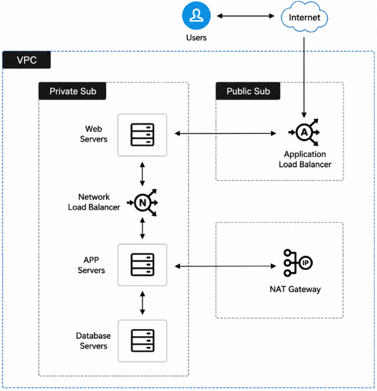
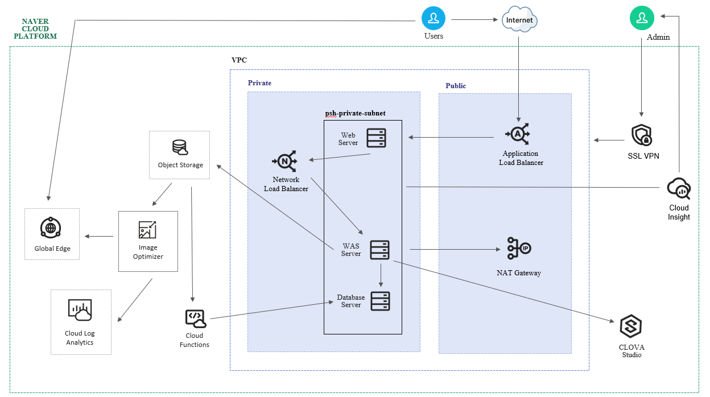
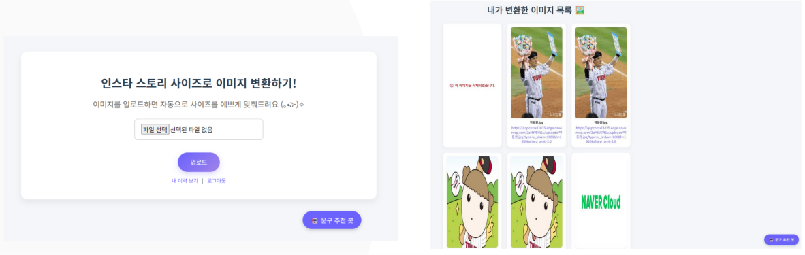
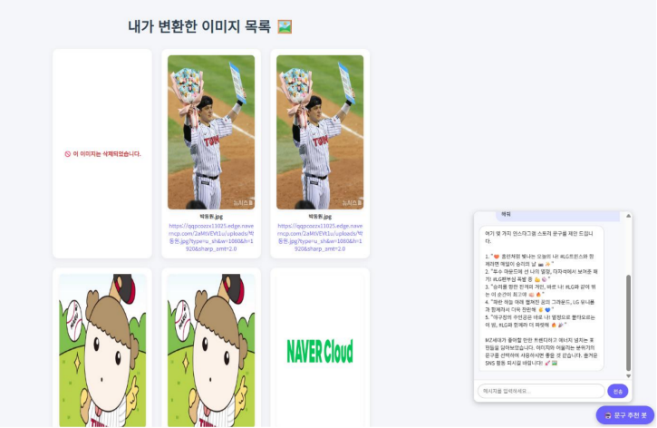

# Naver Cloud 프로젝트

## 프로젝트 기록

프로젝트 진행 과정과 구현 내용은 아래 블로그 게시물에 정리했습니다.
- [NAVER-CLOUD 프로젝트 정리](https://mystory21594.tistory.com/)
- 
### 1. 신규 쇼핑몰 인프라 구축 프로젝트

신규 쇼핑몰 서비스를 운영하기 위해 Naver Cloud를 사용하여 Web, WAS, DB가 분리된 3-Tier 인프라를 구축 및 Flask 기반의 간단한 쇼핑몰 웹 구현

### [ System Architecture ]

  

#### ✨ 주요 기능

- 외부 접속이 필요한 서버와 내부에서만 사용하는 서버를 분리하여 네트워크 구성
- 사용자 요청이 Web Server, Flask WAS, MySQL DB 순서로 전달되도록 3-Tier 환경 구축
- 여러 서버에 사용자 요청을 분산하기 위해 ALB와 NLB 적용
- 외부에 공개되지 않은 내부 서버도 인터넷을 사용할 수 있도록 NAT Gateway 구성
- 관리자가 내부 서버에 안전하게 접속할 수 있도록 SSL VPN과 SSH 접속 환경 설정
- Apache가 사용자 요청을 Flask 애플리케이션으로 전달하도록 Reverse Proxy 설정
- 서버가 재부팅되어도 Flask 애플리케이션이 자동으로 실행되도록 systemd 서비스 등록
- 서버 저장 공간을 확장하기 위해 추가 Block Storage를 연결하고 자동 마운트 설정
- Flask와 Jinja 템플릿을 이용해 상품 목록을 보여주는 간단한 쇼핑몰 화면 구현

#### 🛠️ 사용 기술

- **Cloud:** Naver Cloud Platform
- **Backend:** Python, Flask, Jinja
- **Web·DB:** Apache, MySQL
- **Infrastructure:** Rocky Linux, systemd, SSH

---

### 2. 이미지 변환 웹 서비스 프로젝트

사용자가 업로드한 이미지를 인스타 스토리 규격으로 변환하고, 사용자별 이미지 변환 이력까지 관리하고 챗봇으로 해시태그 제

### [ System Architecture ]

  

#### ✨ 주요 기능

- Flask 웹 페이지에서 이미지를 업로드하고 변환 결과를 확인할 수 있도록 구현
- 업로드된 원본 이미지를 NCP Object Storage에 저장
- Image Optimizer와 Global Edge를 이용해 변환된 이미지를 제공
- 회원가입과 로그인 기능을 구현하고 비밀번호를 해시하여 저장
- 사용자별 이미지 업로드 및 변환 이력을 관리할 수 있도록 구현
- MySQL에 사용자 정보와 이미지 메타데이터를 저장
- Cloud Insight를 이용해 서버 상태를 모니터링하고 이벤트 알림 설정
- HyperCLOVA X를 연동해 사용자 질문에 응답하는 챗봇 기능 구현
- Object Storage Lifecycle과 Cloud Functions를 이용해 이미지 삭제와 데이터베이스 상태 동기화 자동화

#### 🛠️ 사용 기술

- **Cloud:** Naver Cloud Platform
- **Backend:** Python, Flask
- **Frontend:** HTML, CSS, JavaScript
- **Database:** MySQL
- **AI:** HyperCLOVA X

#### 최종 웹사이트 

  

  

